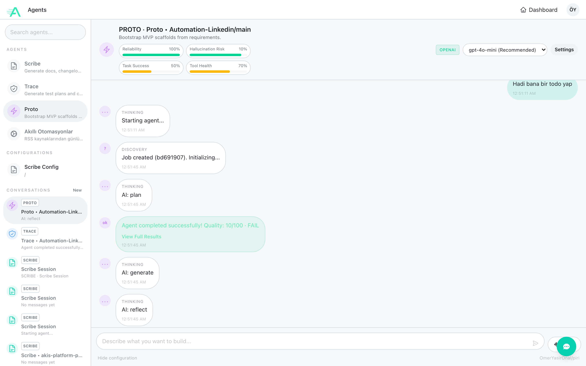
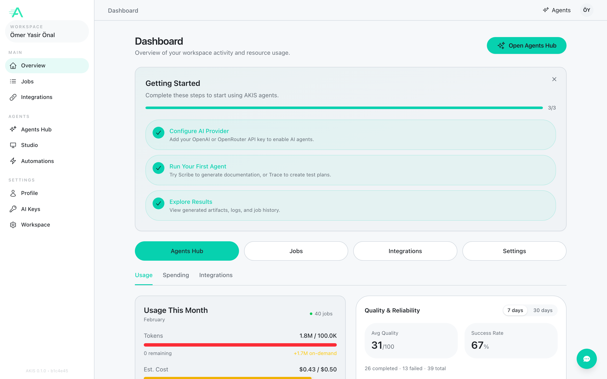

<p align="center">
  
</p>

<h1 align="center">Piri</h1>

<p align="center">
  <strong>Multilingual LLM + RAG Engine by AKIS Platform</strong><br>
  <em>Bilgi denizinde harita cikaran kucuk ama guclu yapay zeka motoru</em>
</p>

<p align="center">
  
  
  
  
  
</p>

<p align="center">
  <a href="#piri-nedir">Piri Nedir?</a> &middot;
  <a href="#v20-yenilikleri">v2.0 Yenilikleri</a> &middot;
  <a href="#kurulum">Kurulum</a> &middot;
  <a href="#hizli-baslangic">Hizli Baslangic</a> &middot;
  <a href="#api-referansi">API</a> &middot;
  <a href="#mimari">Mimari</a> &middot;
  <a href="#degerlendirme">Degerlendirme</a> &middot;
  <a href="#akis-platform-entegrasyonu">AKIS Platform</a>
</p>

---

## Piri Nedir?

**Piri**, [AKIS Platform](https://github.com/OmerYasirOnal/akis-platform-devolopment) ekosisteminin acik kaynak yapay zeka motorudur. Adini, bilinmeyen sularda harita cikaran efsanevi Osmanli kartografi **Piri Reis**'ten alir -- tipki onun gibi, Piri de bilgi tabanlarinda arama yaparak sorularin cevabini bulur.

Piri, bir **Retrieval-Augmented Generation (RAG)** pipeline'i olarak tasarlanmistir. Kullanicinin sorusunu anlar, ilgili dokumanlari vektorel benzerlik ile bulur, cross-encoder reranking ile en kaliteli kaynaklari secer ve dogal dil ile cevap uretir.

### Temel Yetenekler

| Yetenek | Aciklama |
|---------|----------|
| **Multilingual RAG** | 100+ dil destegi, Turkce optimize embedding (`intfloat/multilingual-e5-small`) |
| **Cross-Encoder Reranking** | Iki asamali retrieval: bi-encoder &rarr; cross-encoder, dogruluk %25-40 artis |
| **Dual Backend** | Lokal Qwen2.5-0.5B-Instruct (CPU) veya OpenAI GPT-4o-mini (API) |
| **5 Boyutlu Kalite Olcumu** | Faithfulness, Relevance, Context Precision, Coverage, Coherence |
| **Web Search + Learn** | DuckDuckGo entegrasyonu, bulduklarini bilgi tabanina otomatik ekler |
| **Dosya Yukleme** | Drag-and-drop ile yeni dokumanlar ekle |
| **Web UI** | Tek sayfada RAG Query, Web Search, Learn, Evaluate, Generate |
| **REST API** | FastAPI ile production-ready endpoint'ler |
| **Fine-tuning** | ChatML formatinda ozel veriyle egitim destegi |

---

## v2.0 Yenilikleri

Piri v2.0, v1.0'a gore kapsamli bir kalite ve yetenek guncellesidir:

| Alan | v1.0 | v2.0 |
|------|------|------|
| **Embedding** | `all-MiniLM-L6-v2` (Ingilizce odakli) | `multilingual-e5-small` (100+ dil, Turkce optimize) |
| **Retrieval** | Tek asamali bi-encoder | Iki asamali: bi-encoder &rarr; cross-encoder reranking |
| **LLM Backend** | Sadece lokal Qwen2.5-0.5B | Lokal + OpenAI GPT-4o-mini (otomatik secim) |
| **Post-processing** | Temel temizlik | Artifact removal, duplicate detection, sentence completion |
| **Web Search** | Yok | DuckDuckGo entegrasyonu + otomatik ogrenme |
| **Dosya Yukleme** | Yok | `/rag/upload` endpoint + drag-and-drop UI |
| **Web UI** | Yok (sadece API) | 6 sekmeli tek sayfa uygulama |
| **Prompt Engineering** | Tekil prompt | Backend'e ozel ayri prompt'lar |
| **Error Handling** | Temel | DummyReranker fallback, extractive answer fallback |

---

## Ekran Goruntuleri

### AKIS Platform &mdash; Agent Hub

Agent Hub, Piri dahil tum AKIS agent'lariyla sohbet arayuzu uzerinden etkilesim saglar. Her agent kendi dusunce surecini (thinking, planning, reflection) gercek zamanli olarak gosterir.

<p align="center">
  
</p>

### AKIS Platform &mdash; Dashboard

Dashboard, workspace genelindeki kullanim metrikleri, AI maliyetleri, kalite skorlari ve entegrasyon durumunu tek ekranda sunar.

<p align="center">
  
</p>

### AKIS Platform &mdash; Job Details

Her agent calistirmasi icin detayli run summary: sure, token kullanimi, maliyet tahmini, AI call dagilimi ve trace events.

<p align="center">
  
</p>

---

## Kurulum

### Gereksinimler

- Python 3.9+
- 2GB+ RAM (model yukleme icin)
- Internet baglantisi (ilk model indirme icin)
- *(Opsiyonel)* OpenAI API key &mdash; GPT-4o-mini backend icin

### Adimlar

```bash
# 1. Repo'yu klonla
git clone https://github.com/OmerYasirOnal/piri.git
cd piri

# 2. Sanal ortam olustur ve aktive et
python -m venv venv
source venv/bin/activate  # Windows: venv\Scripts\activate

# 3. Bagimliliklari kur
pip install -r requirements.txt

# 4. Ortam degiskenlerini ayarla (opsiyonel ama onerilen)
cp .env.example .env
# .env dosyasina OpenAI API key ekleyin: OPENAI_API_KEY=sk-...
```

> **Not:** OpenAI API key eklerseniz Piri otomatik olarak GPT-4o-mini backend'ine gecer. Eklenmezse lokal Qwen2.5-0.5B-Instruct kullanilir.

---

## Hizli Baslangic

### 1. Knowledge Base Indeksle

```bash
# Varsayilan knowledge_base/ klasorunu indeksle
python ingest.py

# Ozel klasor belirt
python ingest.py --input ./my_docs --chunk-size 512
```

### 2. API'yi Baslat

```bash
uvicorn main:app --host 0.0.0.0 --port 8000
```

Tarayicida `http://localhost:8000` adresine gidin &mdash; Web UI otomatik olarak acilir.

### 3. Sorgula

```bash
# RAG ile soru-cevap
curl -X POST http://localhost:8000/rag/query \
  -H "Content-Type: application/json" \
  -d '{"question": "RAG pipeline nasil calisir?"}'

# Web arama + ogrenme + cevaplama
curl -X POST http://localhost:8000/rag/web-search \
  -H "Content-Type: application/json" \
  -d '{"query": "Transformer mimarisi nedir?"}'

# Serbest metin uretimi (RAG olmadan)
curl -X POST http://localhost:8000/generate \
  -H "Content-Type: application/json" \
  -d '{"prompt": "Yapay zeka nedir?"}'
```

### 4. Kalite Degerlendirmesi

```bash
# Tum test setini degerlendir
python evaluate.py

# Tek soru degerlendir
python evaluate.py --question "Transformer mimarisi nedir?"

# JSON formatinda cikti
python evaluate.py --json
```

---

## API Referansi

| Endpoint | Method | Aciklama |
|----------|--------|----------|
| `/` | GET | API durumu, versiyon, backend bilgileri |
| `/generate` | POST | Serbest metin uretimi (RAG olmadan) |
| `/rag/query` | POST | RAG ile soru-cevap (retrieve &rarr; rerank &rarr; generate) |
| `/rag/search` | POST | Semantik arama (uretim yapmaz, sadece ilgili chunk'lari dondurur) |
| `/rag/ingest` | POST | Yeni dokuman indeksle (metin olarak) |
| `/rag/upload` | POST | Dosya yukleme ile dokuman indeksle (multipart/form-data) |
| `/rag/web-search` | POST | Web arama &rarr; sonuclari ogren &rarr; cevapla |
| `/rag/learn` | POST | Ham metni bilgi tabanina ekle |
| `/rag/evaluate` | POST | Sorgu + 5 boyutlu kalite degerlendirme |
| `/rag/stats` | GET | RAG sistem istatistikleri (chunk sayisi, model bilgileri) |

### Ornek: RAG Sorgusu

**Istek:**
```json
{
  "question": "LoRA fine-tuning nasil calisir?",
  "top_k": 3,
  "max_new_tokens": 200,
  "temperature": 0.7
}
```

**Yanit:**
```json
{
  "answer": "LoRA, buyuk dil modellerinin agirlik matrislerine...",
  "sources": ["llm_training_techniques.md"],
  "num_sources": 3,
  "retrieval_scores": [
    {"source": "llm_training_techniques.md", "score": 0.8234}
  ]
}
```

### Ornek: Web Search + Learn

**Istek:**
```json
{
  "query": "2024 yapay zeka trendleri"
}
```

**Yanit:**
```json
{
  "answer": "2024'te yapay zeka alaninda...",
  "web_results": 5,
  "learned": true,
  "sources_added": "web_2024_yapay_zeka_trendleri.md"
}
```

---

## Mimari

Piri v2.0, iki asamali retrieval ve dual backend mimarisi kullanir:

```
                            Piri v2.0 Architecture
 ============================================================================

  Kullanici Sorusu
        |
        v
  +------------------+
  |   FastAPI (v2)   |  /rag/query, /rag/web-search, /rag/upload, ...
  +--------+---------+
           |
           v
  +------------------+     +------------------+
  |    Embedder      |     |   Web Search     |
  | multilingual-e5  |     |   (DuckDuckGo)   |
  |   (384 dim)      |     +--------+---------+
  +--------+---------+              |
           |                        v
           v               +------------------+
  +------------------+     |   Auto-Learn     |
  |   Retriever      |     | (chunk + ingest) |
  | FAISS IndexFlatIP|     +------------------+
  | top_k x 4 aday   |
  +--------+---------+
           |
           v
  +------------------+
  |    Reranker      |     Iki Asamali Retrieval:
  | cross-encoder    |     1. Bi-encoder  -> genis aday listesi
  |  mMiniLM v2      |     2. Cross-encoder -> en kaliteli top_k
  | hybrid: 70/30    |
  +--------+---------+
           |
           v
  +------------------+
  |  LLM Generator   |
  |                  |
  |  [OpenAI]        |     OPENAI_API_KEY varsa -> GPT-4o-mini
  |  [Local ]        |     yoksa -> Qwen2.5-0.5B-Instruct (CPU)
  +--------+---------+
           |
           v
  +------------------+
  | Post-Processing  |     Artifact removal, duplicate detection,
  | + Quality Check  |     sentence completion, heuristic scoring
  +--------+---------+
           |
           v
  +------------------+
  |    Evaluator     |     5 boyutlu kalite degerlendirme:
  | (5-dim scoring)  |     Faithfulness, Relevance, Precision,
  |                  |     Coverage, Coherence
  +------------------+
```

### Bilesenler

| Modul | Dosya | Aciklama |
|-------|-------|----------|
| **Engine** | `piri/engine.py` | RAG orkestrasyon &mdash; retrieve &rarr; rerank &rarr; augment &rarr; generate |
| **Chunker** | `piri/chunker.py` | Dokuman bolumleme (cumle-aware, overlap) |
| **Embedder** | `piri/embedder.py` | `intfloat/multilingual-e5-small` ile metin &rarr; vektor (384d) |
| **Retriever** | `piri/retriever.py` | Bi-encoder ile genis aday listesi + reranker entegrasyonu |
| **Reranker** | `piri/reranker.py` | `mmarco-mMiniLMv2-L12-H384-v1` cross-encoder, hybrid %70/%30 scoring |
| **VectorStore** | `piri/vector_store.py` | FAISS IndexFlatIP, persist/load |
| **Evaluator** | `piri/evaluator.py` | 5 boyutlu kalite degerlendirme |
| **Web Search** | `piri/web_search.py` | DuckDuckGo entegrasyonu, sonuc derleme |

### Kullanilan Modeller

| Model | Tip | Boyut | Aciklama |
|-------|-----|-------|----------|
| `intfloat/multilingual-e5-small` | Embedding | 384d | 100+ dil, Turkce optimize, E5 prefix destegi |
| `mmarco-mMiniLMv2-L12-H384-v1` | Cross-Encoder | - | Multilingual reranking, 100+ dil |
| `Qwen/Qwen2.5-0.5B-Instruct` | LLM (lokal) | ~500M | CPU uzerinde calisir, ChatML format |
| `gpt-4o-mini` | LLM (API) | - | OpenAI API, yuksek kalite (opsiyonel) |

---

## Degerlendirme

Piri, RAG yanitlarini 5 boyutta degerlendirir. Bu metrikler Lewis et al. (2020) RAG makalesindeki kalite boyutlarina dayanir:

| Metrik | Agirlik | Aciklama |
|--------|---------|----------|
| **Faithfulness** | %30 | Cevap baglama ne kadar sadik? (halucinasyon tespiti) |
| **Relevance** | %25 | Cevap soruyu ne kadar yanitliyor? |
| **Context Precision** | %15 | Dogru chunk'lar mi getirildi? |
| **Coverage** | %15 | Baglamdaki bilgi cevaba ne kadar yansimis? |
| **Coherence** | %15 | Cevap tutarli ve okunabilir mi? |

### Ornek Degerlendirme Ciktisi

```
  GENEL SKOR: 0.72/1.00  [GOOD]
  ████████████████░░░░ 72%

  Faithfulness         0.85    30%    FAITHFUL
  Relevance            0.78    25%    RELEVANT
  Context Precision    0.65    15%    GOOD_RETRIEVAL
  Coverage             0.58    15%    COMPREHENSIVE
  Coherence            0.61    15%    COHERENT
```

---

## Fine-tuning

Piri, ozel veriyle fine-tune edilebilir:

```bash
# 1. ChatML formatinda egitim verisi hazirla (data/rag_train.jsonl)
#    Her satir: {"messages": [{"role": "system", ...}, {"role": "user", ...}, {"role": "assistant", ...}]}

# 2. Egitimi baslat
python train.py --epochs 2 --batch-size 1 --lr 1e-5

# 3. Sadece modeli indir (egitim yapmadan)
python train.py --skip-train
```

---

## AKIS Platform Entegrasyonu

Piri, **AKIS Platform**'un dort agent'indan biridir. AKIS Platform, yazilim gelistirme sureclerini yapay zeka ile otomize eden bir platformdur. Her agent, belirli bir goreve uzmanlasmistir:

| Agent | Gorev | Teknoloji | Durum |
|-------|-------|-----------|-------|
| **Scribe** | Dokuman uretimi (README, changelog, API spec) | TypeScript + MCP | Aktif |
| **Trace** | Test plani ve Playwright test kodu uretimi | TypeScript + MCP | Aktif |
| **Proto** | MVP prototip iskelesi uretimi | TypeScript + MCP | Aktif |
| **Piri** | Bilgi motoru + RAG + Degerlendirme | Python + FAISS | Aktif |

### Platform Ozellikleri

- **Agent Orkestrasyon:** FSM tabanli is yasam dongusu yonetimi
- **Gercek Zamanli Izleme:** SSE ile agent dusunce surecini canli akis
- **Kalite Kapisi:** Her calistirma icin 0-100 kalite skoru
- **MCP Entegrasyonu:** GitHub, Jira, Confluence adaptoleri
- **Akilli Otomasyonlar:** RSS, zamanlanmis gorevler

Piri, diger agent'lardan bagimsiz olarak da kullanilabilir &mdash; tamamen acik kaynak ve standalone calisir.

---

## Proje Yapisi

```
piri/
├── main.py                 # FastAPI uygulamasi (v2.0.0)
├── train.py                # Fine-tuning scripti
├── ingest.py               # Knowledge base indeksleme
├── evaluate.py             # Kalite degerlendirme
├── requirements.txt        # Python bagimliliklari
├── pyproject.toml          # Paket yapilandirmasi
├── .env.example            # Ortam degiskenleri sablonu
├── LICENSE                 # MIT Lisansi
├── piri/                   # Core paket
│   ├── __init__.py         # v2.0.0, PiriEngine export
│   ├── engine.py           # RAG Engine (dual backend, prompt eng.)
│   ├── chunker.py          # Dokuman chunking (cumle-aware)
│   ├── embedder.py         # Multilingual E5 embedding (384d)
│   ├── retriever.py        # Bi-encoder retrieval + reranker bridge
│   ├── reranker.py         # Cross-encoder reranking (hybrid 70/30)
│   ├── vector_store.py     # FAISS vektor store (persist/load)
│   ├── evaluator.py        # 5 boyutlu kalite degerlendirme
│   └── web_search.py       # DuckDuckGo web arama entegrasyonu
├── knowledge_base/         # Ornek bilgi tabani
│   ├── agent_architectures.md
│   ├── ai_frameworks.md
│   ├── llm_training_techniques.md
│   ├── prompt_engineering.md
│   └── rag_literature.md
├── static/                 # Web UI (tek sayfa uygulama)
│   └── index.html
├── data/                   # Egitim verileri (ChatML JSONL)
└── docs/                   # Dokumantasyon ve ekran goruntuleri
    └── screenshots/
```

---

## Akademik Referanslar

Piri'nin tasariminda asagidaki akademik calismalara dayanilmistir:

1. **Lewis, P. et al. (2020).** *Retrieval-Augmented Generation for Knowledge-Intensive NLP Tasks.* NeurIPS 2020. &mdash; RAG pipeline tasarimi.
2. **Reimers, N. & Gurevych, I. (2019).** *Sentence-BERT: Sentence Embeddings using Siamese BERT-Networks.* EMNLP 2019. &mdash; Bi-encoder embedding yontemi.
3. **Nogueira, R. et al. (2020).** *Document Ranking with a Pretrained Sequence-to-Sequence Model.* EMNLP 2020. &mdash; Cross-encoder reranking stratejisi.
4. **Wang, L. et al. (2022).** *Text Embeddings by Weakly-Supervised Contrastive Pre-training (E5).* &mdash; Multilingual E5 embedding modeli.
5. **Bonifacio, L. et al. (2022).** *mMARCO: A Multilingual Version of MS MARCO.* &mdash; Multilingual cross-encoder egitim verisi.

---

## Ortam Degiskenleri

| Degisken | Varsayilan | Aciklama |
|----------|-----------|----------|
| `OPENAI_API_KEY` | *(bos)* | OpenAI API key &mdash; varsa GPT-4o-mini kullanilir |
| `OPENAI_MODEL` | `gpt-4o-mini` | OpenAI model secimi |
| `PIRI_MODEL_PATH` | `Qwen/Qwen2.5-0.5B-Instruct` | Lokal LLM model yolu |
| `PIRI_EMBEDDING_MODEL` | `intfloat/multilingual-e5-small` | Embedding modeli |
| `PIRI_RERANKING` | `true` | Cross-encoder reranking aktif/pasif |

---

## Katkida Bulunma

Katkilarinizi bekliyoruz!

1. Fork edin
2. Feature branch olusturun (`git checkout -b feature/yeni-ozellik`)
3. Degisikliklerinizi commit edin (`git commit -m 'feat: yeni ozellik ekle'`)
4. Push edin (`git push origin feature/yeni-ozellik`)
5. Pull Request acin

---

## Lisans

MIT License &mdash; detaylar icin [LICENSE](LICENSE) dosyasina bakin.

---

<p align="center">
  <strong>Piri v2.0</strong> &mdash; AKIS Platform tarafindan gelistirilmistir.<br>
  <em>"Haritasi olmayana her ruzgar ters eser." &mdash; Piri Reis</em>
</p>
